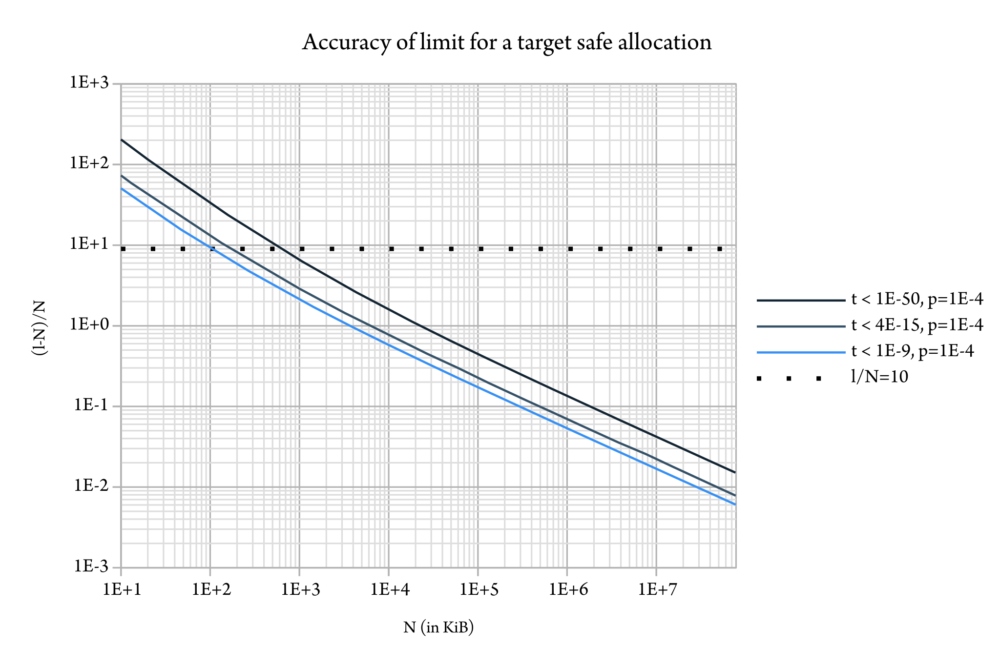
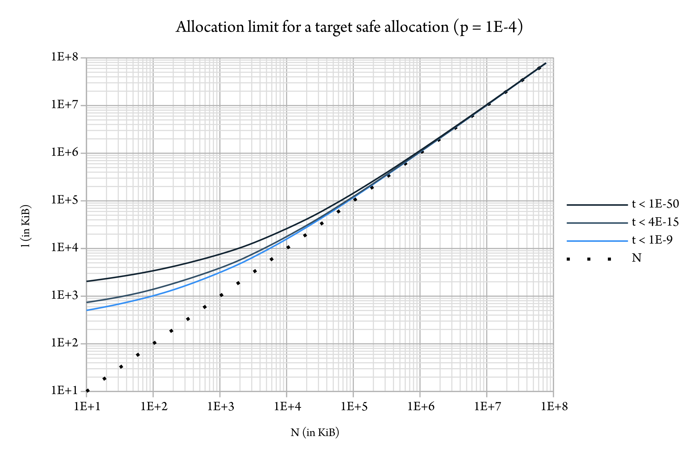

# memprof-limits — Memory limits based on memprof

Memprof-limits is an implementation of per-thread global memory
limits, and per-thread allocation limits à la Haskell for OCaml,
compatible with systhreads. It interrupts a computation by raising an
exception asynchronously into user code.

The implementation uses memprof with a low sampling rate that does not
affect performance.

Home page: https://gitlab.com/gadmm/memprof-limits

Memprof-limits is distributed under the LGPL license version 3, see
LICENSE.

## 1. Installation

~Memprof-limits can be installed with opam. It requires OCaml 4.11, which is currently available through the beta repository.~ (soon)

If you do not use opam consult the [opam](memprof-limits.opam) file
for build instructions.

## 2. Usage

### Global memory limit

Per-thread global memory limits let you bound the memory consumption
of specific parts of your program, in terms of memory used by the
whole program (major heap words).

```ocaml
let M = Memprof_limits

(* worker *)
let f () = ...

(* monitor *)
let g () =
  (* 1 GiB memory limit *)
  M.set_global_memory_limit (1024 * 1024) ;
  match M.with_global_memory_limit f with
  | Ok x -> ...
  | Error _ -> (* Out of memory *) ...

(* main *)
let () =
  M.with_memprof_limits @@ fun () -> ... g ...
```

### Allocation limit

Per-thread allocation limits let you bound the execution of parts of
the program measured in number of allocation, analogous to the same
feature in Haskell. Allocation limits count allocations but not
deallocations, and is therefore a measure of the work done which can
be more suitable than execution time.

```ocaml
let M = Memprof_limits

(* worker *)
let f () = ...

(* monitor *)
let g () =
  (* 100 MiB allocation limit *)
  match M.with_allocation_limit ~limit:(100 * 1024) f with
  | Ok x -> ...
  | Error _ -> (* Out of fuel *) ...

(* main *)
let () = M.with_memprof_limits @@ fun () -> ... g ...
```

See the documentation below for advice on the choice of `limit`.

## 3. User guide

- The interface is documented in
[`memprof_limits.mli`](src/memprof_limits.mli); examples are given
above.
- Further below you can find: an [explanation of what must be done to
ensure one recovers from a memprof-limits exception](#recover), and a
[statistical analysis of the different limits](#statistical) that
should help chosing appropriate values for parameters.

### Profiling

Memprof-limits reimplements a fully API-compatible interface to
memprof. Users who want to use memprof to profile their application
that uses memprof-limits must use that interface instead of the one
from `Stdlib.Gc`.

### Limitations

This software is experimental.

A couple of `FIXME`s are being worked on to be proposed for correction
in OCaml, mainly about races involving asynchronous exceptions. In
other words the implementation is not correct in 4.11 and will not be
fixed before a future minor release of OCaml.

## 4. How to recover from the memprof-limits exceptions     <a href="recover"></a>

Memprof-limits interrupts user code by raising an exception in some
allocation point chosen by the memprof engine if some limit is
reached. It is in general not possible to reason about where this
exception will arise and to handle it locally: there are far too many
possible locations in the code. Because of that, such exceptions are
called _asynchronous interrupts_ (John Reppy, _“Asynchronous signals
in Standard ML”_, 1990).

The advantage of asynchrony is that the user code always remains
responsive to memprof-limits interruptions, without requiring user
code nor libraries it depends on to be adapted to actively poll
memprof-limits. The downside is that the asynchronous interrupt is
akin to other _unexpected exceptions_ : conditions that indicate the
failure of the whole task at hand, such as `Out_of_memory`,
`Stack_overflow`, `Assert_failure`… and as opposed to error codes
intended to be handled locally, and to jumps. The recovery from these
unexpected exceptions is subject to some discipline, which we describe
now.

1. Do not rely on the returned exception
2. Re-raise exceptions promptly
3. Ensure isolation of state

### Do not rely on the returned exception

The generic form to treat the return value is the following.

```ocaml
match Memprof_limits.with_global_memory_limit user_code with
| Ok result -> ...
| Error exn1 -> (* limit reached *) ...
| exception exn2 -> (* some other error *) ...
```

The Error case is encountered whenever the computation in f has been
interrupted by the corresponding limit being reached, whether f has
returned normally (e.g. `()`) for some reason, has let through the
exception raised by memprof-limits, or has raised any other exception
instead. In the latter case, this exception is `exn1`.

If the limit has not been reached, the exception (`exn2`) is not
caught by memprof-limits.

The reason for catching any possible exception, and not just the
exception raised by memprof-limits, is that it is not reliable to
catch a specific asynchronous interrupt. The exception could for
instance be caught in the user code with the intention of
re-raising it, and in that time another unexpected exception could
arise, causing the original exception to be discarded. Yet it may very
well be that the first one being raised at an impromptu location was
the cause of the second one: _what if the first one should have been
kept and the second one discarded instead?_ In addition, exceptions
are sometimes wrapped, such as inside the `Dynlink.Error` and
`Fun.Finally_raised` exceptions, to give them additional meaning.

The indiscernability of asynchronous interrupts was noticed in
Standard ML, which has attempted to solve it by representing all
causes of interruption (out of memory, stack overflow, sigint…) with a
single exception `Interrupt`. While Standard ML's notion of dedicated
interrupt has never been part of OCaml, we can emulate it as a
programmer discipline, by never matching on specific interrupts, and
using the catch-all `_` instead. This amounts to _treating all
asynchronous interrupts, bugs, and uncaught exceptions at that
location_ identically.

In order to reliably tell whether a computation has been interrupted,
memprof-limits instead records with a flag whether it has previously
raised an exception due to this limit instance. It then considers that
any exception arising after it can be discarded, assuming that the
monitored computation is properly isolated (see further below).

### Re-raise exceptions promptly

Software reliant on interrupts, such as Isabelle or Coq, have found
necessary to request from users that they re-raise interrupts
promptly. For instance, the [Isabelle/ML
manual](http://isabelle.in.tum.de/dist/library/Doc/Implementation/ML.html)
states:

> Isabelle/ML user code needs to terminate promptly on interruption,
> without guessing at its meaning to the system infrastructure.
> Temporary handling of interrupts for cleanup of global resources
> etc. needs to be followed immediately by re-raising of the original
> exception.

For this purpose, both Isabelle/ML (and Coq in some sense) introduce
predicates to test whether an exception is an interrupt, so that the
user can act accordingly.

OCaml does not have a built-in notion of interrupt and therefore does
not provide such a predicate. However, another property comes save
memprof-limits: if it happened that an interrupt was not re-raised
promptly, then the code will be interrupted again soon.

In practice, memprof-limits relies on some cooperation from the
user code. It is recommended not to use the catch-all `_`, and to
rely instead on standard library combinators such as `Fun.protect`,
which ensure that the interrupt is not discarded.

### Ensure isolation of state

We have mentioned that memprof-limits catches all exceptions if a
limit is reached, which amounts to treating bugs and uncaught
exceptions as interrupts too. In fact the memprof-limits function acts
as an _isolation boundary_, similar to a toplevel prompt or a thread.

One aspect of isolation concerns the consistency of state in user
code. An exception raised asynchronously can corrupt state if it
occurs in the middle of a block meant to maintain some invariant.
Then, it is the responsibility of the person catching the interrupt to
make sure that no corrupt state escapes the boundary. This is done in
two fashion:

- _Internal_ state is one that is not shared outside of the boundary.
  Since the interrupt has the intent of halting the whole computation,
  internal state is permitted to be corrupted in a transient manner,
  while the user code performs clean-up, since nobody will be there to
  witness the corrupt state afterwards.

- Modifications to the _external_ state must be protected against
  asynchronous exceptions in order for corrupted state not to be
  visible. This can be achieved for instance with a clean-up action
  that rolls back to a previous value, or communicates the failure.
  For instance, in the Rust language, the release action associated to
  a mutex lock is responsible not only for unlocking the mutex, but
  also for _“poisoning”_ it in case of error, meaning that the data it
  protects cannot be accessed normally any further.

Thus, if we adopt the point of view of user code, that is if we choose
to see the rest of the program and what is beyond it as “the world”,
then the programmer does not have to reason about asynchronous
exceptions: indeed, (internal) state will disappear along with their
program, whereas accesses to the state of the world must be mediated
using resource abstractions which they assume correctly handle the
failure case.

### Summary

- The user code must simply be written like any program on its own,
programmed to clean-up and “fail fast” in the event of a failure.
- The catching code must make sure not to share state with the user code
unless access to this state is protected under a resource abstraction.

## 5. Statistical analysis                    <a name="statistical"></a>

p: sampling rate

p = 10^-4 samples per word

S = 1/p: expected trigger allocation

S = 10^4 words

That is, S is about 39.0 KiB on 32-bit and 78.1 KiB on 64-bit. The
values in KiB given in the charts below assume a 64-bit word size; the
(greater) accuracies for 32-bit can be obtained by dividing the KiB
values by two.

### Global memory limit

P(n): probability of triggering a callback after n allocations

P(n) ≥ 1 - e^-(n/S)

Thus, once the memory limit is reached, on 64-bit:
- there is more than 64% probability that the function has been
  interrupted after 80 KiB of allocations,
- there is a probability less than 10^-9 that the function has not
  been interrupted after 1.62 MiB of allocations
- there is a probability less than 10^-14 that the function has not
  been interrupted after 2.5 MiB of allocations
- there is a probability less than 10^-50 that the function has not
  been interrupted after 8.8 MiB of allocations

### Allocation limits

l: limit chosen by the user

k: number of memprof callback runs needed to interrupt the function

k = l/S

#### Probability of being interrupted

P(n): probability of being interrupted after n allocations. It is is
given by the cumulative binomial distribution, that is, one has in
terms of the regularized incomplete beta function I:

P(n) = Iₚ(k,n-k+1)


#### Accuracy of limit

t: target safe probability

N: lower bound on the number of “safe” allocations, that is,
allocations that can be performed while the cumulative probability of
being interrupted remains less than t.

N is estimated for various values of k, and the error (l-N)/N is
given below for t = 10^-9, t = 4.10^-15, and t = 10^-50.



The same data indicates a value for l for a given N.



The allocation limit is reasonably accurate (i.e. l is less than an
order of magnitude greater than N) starting around N = 100 KiB, that
is around l = 1 MiB. Allocation limits lesser than 500 KiB on the
other hand are probably too inaccurate to be meaningful.

#### Impact of the sampling value

This data is given for the default sampling rate. When memprof is used
for profiling via the provided Memprof module, the user's sampling
rate is used instead. But, memprof-limits will refuse to run with
sampling rates less than the default one. As a consequence, the limits
can only get more accurate, such that the lower bounds remain valid.

From a theoretical point of view, one can wonder whether it is useful
to increase the default rate. Below is the minimal sampling rate
for a target safe allocation assuming l is chosen an order of
magnitude greater than N.


The default sampling rate (10^-4) is one among several possible
choices that provide reasonable accuracy without affecting
performance. Nevertheless, feedback regarding the need of being able
to select a greater accuracy is welcome.
