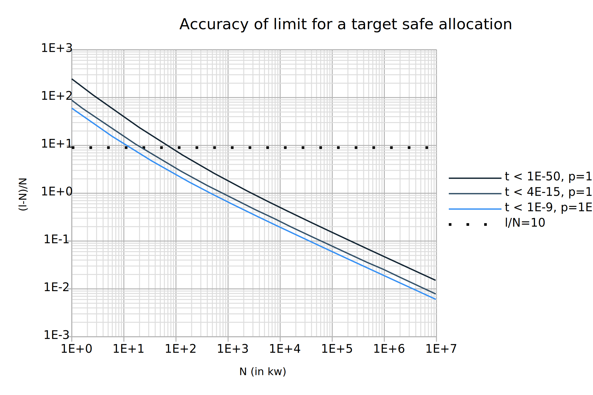
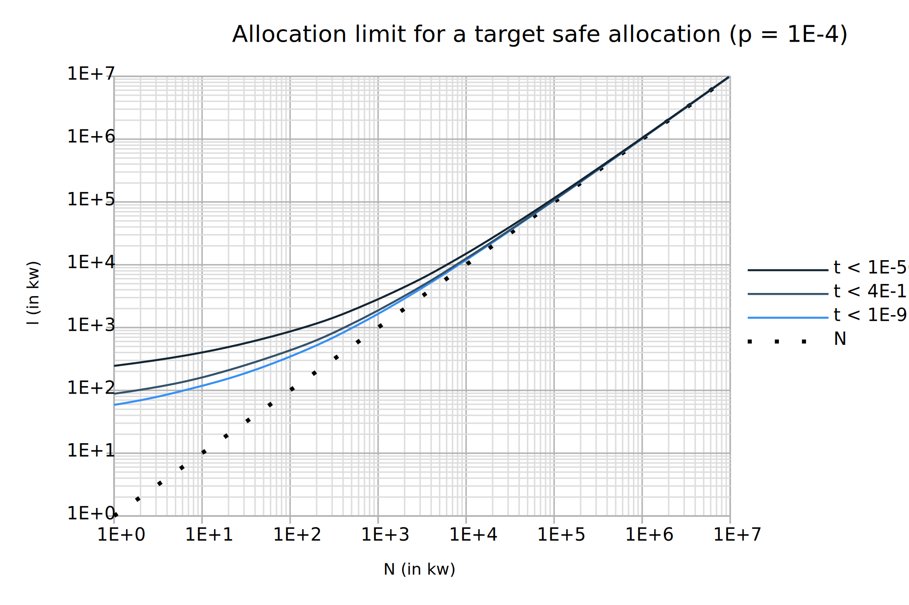

## Statistical analysis

- *p*: sampling rate
- *S*: expected trigger allocation

By default, *p* = 10^-4 samples per word.

We have *S* = 1/*p* = 10 kw (by default). That is, *S* is about 39.0
kiB of allocations on 32-bit and 78.1 kiB on 64-bit.

### Global memory limit

*P*(*n*): probability of triggering a callback after n allocations

One has:

*P*(*n*) ≥ 1 - e^-(*n*/*S*)

Thus, once the memory limit is reached, on 64-bit:
- there is more than 64% probability that the function has been
  interrupted after 80 kiB of allocations,
- there is a probability less than 1E-9 that the function has not
  been interrupted after 1.62 MiB of allocations
- there is a probability less than 1E-14 that the function has not
  been interrupted after 2.5 MiB of allocations
- there is a probability less than 1E-50 that the function has not
  been interrupted after 8.8 MiB of allocations

### Allocation limits

- *l*: limit chosen by the user
- *k*: number of memprof callback runs needed to interrupt the function

We have: *k* = *l*/*S*

#### Probability of being interrupted

*P*(*n*): probability of being interrupted after *n* allocations. It
is given by the cumulative binomial distribution, that is, one has in
terms of the regularized incomplete beta function I:

*P*(*n*) = Iₚ(*k*,*n*-*k*+1)

#### Accuracy of limit

- *t*: target safe probability
- *N*: maximum number of *safe* allocations, that is, allocations that
can be performed while the cumulative probability of being interrupted
remains less than *t*.

A good lower bound for *N* is estimated for various values of *k*, and
the error (*l*-*N*)/*N* is given below for *t* = 1E-9, *t* = 4E-15,
and *t* = 1E-50. (1E-9 is the probability to win the lottery, 1E-50 is
considered implausible by physicists' standards.)

The same data gives us an indicative value for *l* for a given *N*.

The allocation limit is reasonably accurate (i.e. *l* is less than an
order of magnitude greater than *N*) starting at around *N* = 20kw,
that is for a target safe probability of 4E-15 around a limit of *l* =
200kw. Allocation limits *l* ≤ 60kw on the other hand are probably too
inaccurate to be meaningful.

#### Impact of the sampling value

This data is given for the default sampling rate. When memprof is used
for profiling via the provided Memprof module, the user's sampling
rate is used instead. But, memprof-limits will refuse to run with
sampling rates less than the default one. As a consequence, the limits
can only get more accurate, such that *N* remains a safe allocation
number.

From a theoretical point of view, one can wonder whether it is useful
to increase the default rate. Below is the minimal sampling rate
for a target safe allocation assuming *l* is chosen an order of
magnitude greater than *N*.

The default sampling rate (1E-4) is one among several possible choices
that provide reasonable accuracy without affecting performance.
Nevertheless, feedback regarding the need of being able to select a
greater (or lower) sampling rate is welcome.
