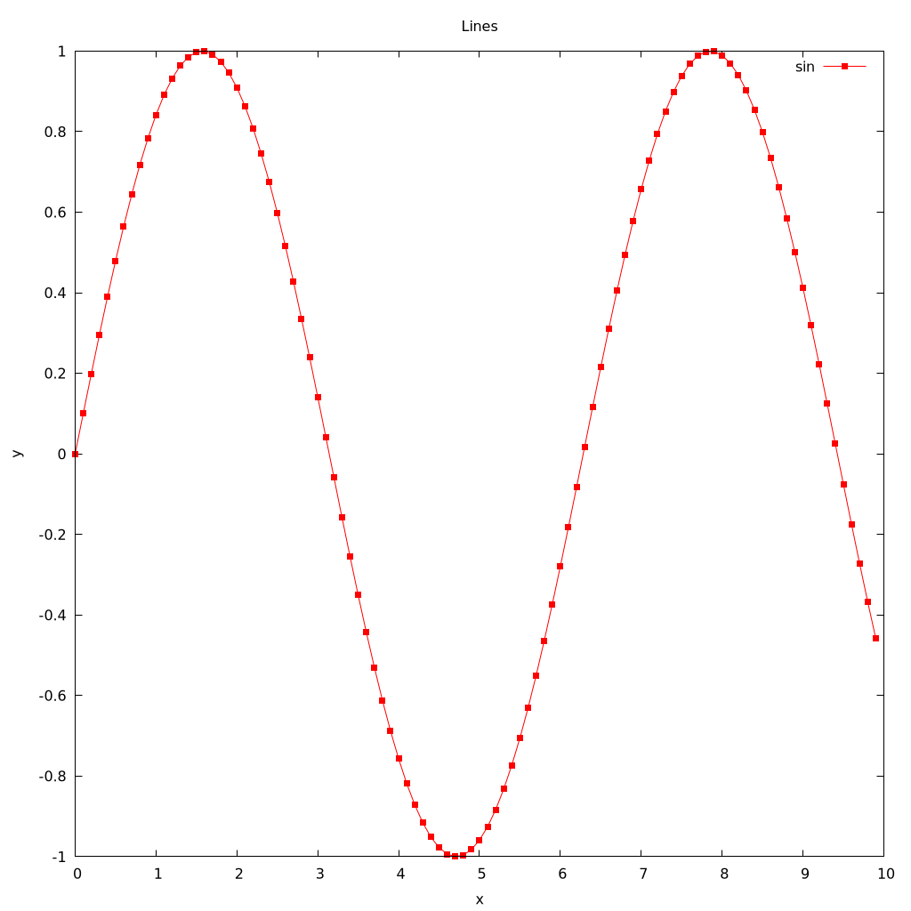

prbnmcn-gnuplot
---------------

This library provides an relatively basic overlay over Gnuplot. It provides
facilities for performing scatterplots, line plots and histograms.

Look no further for the [documentation][doc-link].

Note that some features exposed by the library do not work with Gnuplot versions
below 5.4.

Here's a tiny example, plotting a sine function and displaying it on the Qt
backend.

```ocaml
let discretize f =
  Array.init 100 (fun i ->
      let x = float_of_int i *. 0.1 in
      Plot.r2 x (f x))

let sin =
  let open Plot in
  Line.line_2d
    ~points:(Data.of_array (discretize sin))
    ~style:
      Style.(default |> set_color Color.red |> set_point ~ptyp:Pointtype.box)
    ~with_points:true
    ~legend:"sin"
    ()

let () =
  let target = Plot.qt () in
  Plot.(run
         ~target
         ~plot:(plot2 ~xaxis:"x" ~yaxis:"y" ~title:"sin" [sin])
         exec)
```
This produces something like this.


An alternative to this library is [ocaml-gnuplot][alt-link].

[doc-link]: https://igarnier.github.io/prbnmcn-gnuplot/
[alt-link]: https://github.com/c-cube/ocaml-gnuplot/
