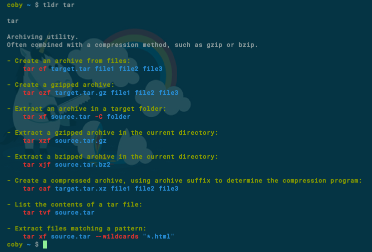

# tldr-ocaml
[](https://travis-ci.org/RosalesJ/tldr-ocaml)

A client for [tldr](https://github.com/tldr-pages/tldr) written in ```ocaml```.



## Installation
Install from opam with:
```
opam install tldr
```
Or from source with dune:
```
git clone https://github.com/RosalesJ/tldr-ocaml.git
cd tldr-ocaml
dune build @install
dune install
```

## Configuration
You can configure tldr by setting environment variables:
```bash
export TLDR_CACHE_ENABLED=1      # Caching is enabled (default)
export TLDR_MAX_CACHE_AGE=168    # Cached pages last 168 hours (default is 24)
```

### Cache
If caching is enabled then tldr will attempt to load from the cache before fetching from the internet.
The cache is located in one of the following locations in decreasing order of precedence.
* ```$XDG_CACHE_HOME/tldr```
* ```$HOME/.cache/tldr```
* ```~/.cache/tldr```
